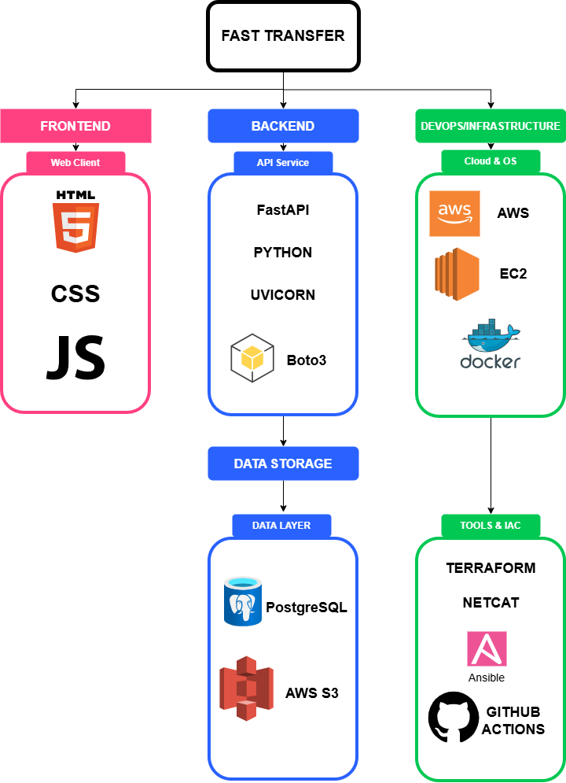
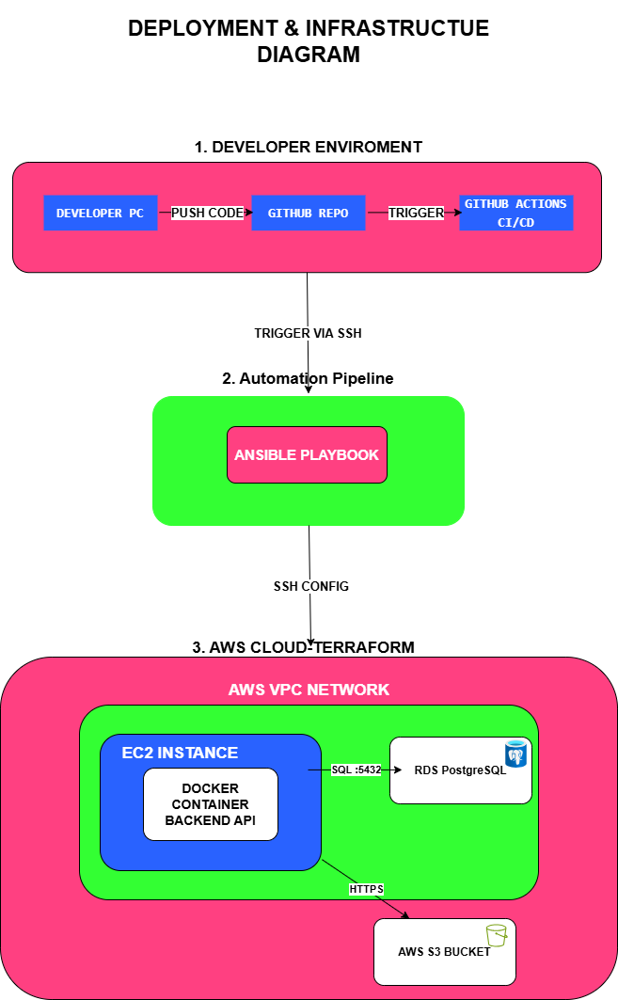
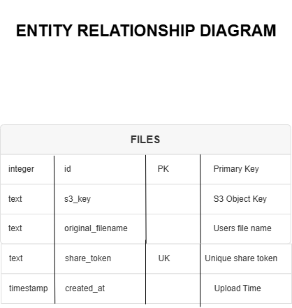

# Fast Transfer

This website allows users to upload files and instantly generate a unique shareable URL.
You can send this link to anyone so they can download the file directly.

Infrastructure is fully managed using **Terraform**, which automatically provisions **Amazon S3, Amazon RDS, IAM roles**, and all required cloud resources. The application logic runs on a dedicated **AWS EC2 instance** and configuration and application deployment are fully automated using **Ansible**. **GitHub Actions** handles the deployment process, automatically updating the live server whenever new code is pushed, eliminating the need for manual changes.

The project supports **JPEG, PNG, and PDF** files.
Before uploading, it validates the file type and file size to ensure it meets the allowed criteria.

Downloads utilize **AWS S3 Presigned URLs** for secure, direct file access.

File metadata such as filename and file type is stored in an **Amazon RDS PostgreSQL database**.

This project includes **full Docker support** for both the backend API and the PostgreSQL database. Therefore this setup provides a fast, reliable, and scalable file sharing solution.

---

## 🏗️ System Architecture & Visual Documentation

### 1. High-Level Tech Stack
Overview of the technologies: FastAPI, AWS (S3, RDS, EC2), Docker, and Terraform.

### 2. Infrastructure & Deployment Pipeline
Visualizing the automation flow: **GitHub Actions** triggers **Ansible** to configure the **EC2** instance provisioned by **Terraform**.

### 3. Backend Component Architecture
Detailed view of the internal structure, showing how the **Controllers, Services, and Data Layers** interact within the FastAPI container.

### 4. Upload Workflow (Sequence Diagram)
The step-by-step process of validating a file and streaming it securely to **AWS S3**.

### 5. Secure Download Workflow (Sequence Diagram)
How the system generates **Presigned URLs** to allow secure access without exposing backend resources.

### 6. Container Startup Logic
The self-healing mechanism that ensures the database is ready before the API starts (`wait-for-db`).

### 7. Database Schema (ERD)
The structure of the PostgreSQL metadata table.
